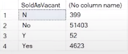
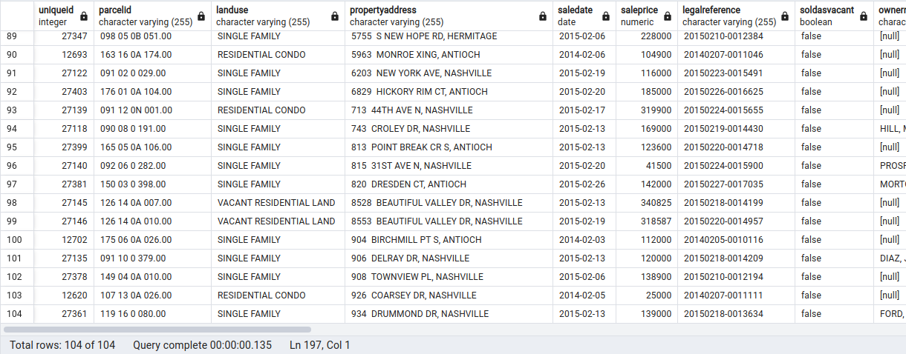

# Data Cleaning in PostgreSQL

This portfolio project showcases my data cleaning skills using PostgreSQL. The project 
focuses on cleaning and transforming the Nashville Housing Data to ensure accuracy and usability.
You can check the query within .

## Table of Contents
- [Project Overview](#project-overview)
- [Data Sources](#data-sources)
- [Tools and Technologies](#tools-and-technologies)
- [Data Cleaning](#data-cleaning)
- [Conclusion](#conclusion)

## Project Overview

This project involves:
1. Cleaning and transforming Nashville Housing Data.
2. Ensuring data accuracy and usability.
3. Demonstrating advanced data cleaning techniques using PostgreSQL.

## Data Sources

- **Nashville Housing Data**: Downloaded from [here](https://github.com/AlexTheAnalyst/PortfolioProjects/blob/main/Nashville%20Housing%20Data%20for%20Data%20Cleaning.xlsx).

## Tools and Technologies

- **PostgreSQL**: For data cleaning and transformation.
- **Excel**: For initial data inspection.

## Data Cleaning

### Standardize Sales Date Format
Standardize the sales date format using TO_DATE during the data import process.

### Fill Null Property Addresses
Use other data points to fill in null property addresses based on matching ParcelID.
```sql
SELECT 
    a.ParcelID, 
    a.PropertyAddress, 
    b.ParcelID, 
    b.PropertyAddress,
    COALESCE(a.PropertyAddress, b.PropertyAddress) AS CorrectedPropertyAddress
FROM hashville a
JOIN hashville b
    ON a.ParcelID = b.ParcelID
    AND a.UniqueID <> b.UniqueID
WHERE a.PropertyAddress IS NULL;
```
### Split Property and Owner Address
Split the addresses into separate columns for address and city.

    

### Translate "Sold As Vacant" Field
Translate 'Y' and 'N' values in the SoldAsVacant field to 'Yes' and 'No'.

    

### Remove Duplicates
Remove duplicate rows using a Common Table Expression (CTE) and window functions.

    

## Conclusion
This project demonstrates my ability to clean and transform data using PostgreSQL. The steps taken 
ensure that the Nashville Housing Data is accurate, standardized, and ready for analysis. 
By leveraging SQL functions and best practices.
